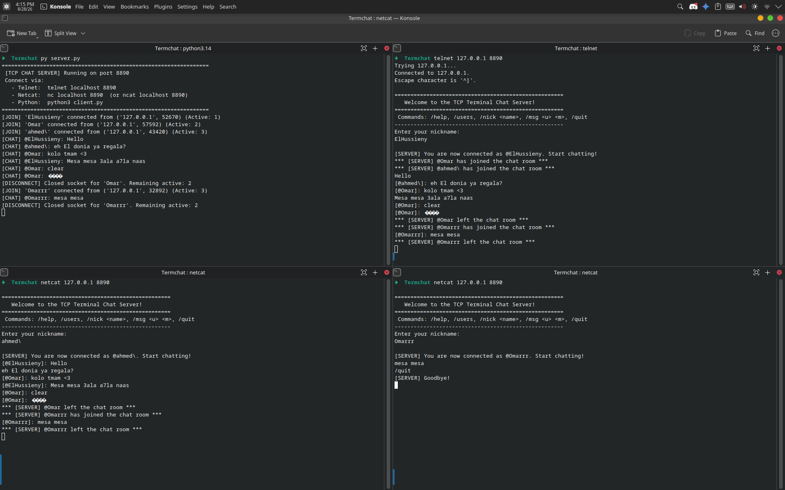

# TermChat: Multi-Client TCP Terminal Chat Server

[](https://github.com/elhussienysabry/Termchat/actions/workflows/ci.yml)
[](https://www.python.org/)
[](LICENSE)

A hands-on, educational TCP networking project demonstrating how real-world chat servers, protocols, and terminal clients work under the hood.

Connect using standard network utilities (**`telnet`**, **`nc` / `ncat`**) or the included Python client.

---

## Directory Structure

```
Termchat/
|-- Images/
|   `-- multichat.png       # Screenshot demo
|-- client.py               # Full-duplex Python terminal client
|-- server.py               # Multi-threaded TCP server with Telnet & command support
|-- LICENSE                 # Open-source MIT License
`-- README.md               # Documentation
```

---

## Demo Preview



---

## How to Run and Connect

### Step 1: Start the Chat Server
Open a terminal and run:
```bash
python3 server.py
```

The server listens on port **`8890`** on all network interfaces (`0.0.0.0`).

---

### Step 2: Connect from Any Terminal

You can connect in multiple ways:

#### Option A: Connect with `nc` (Netcat) / `ncat`
```bash
nc 127.0.0.1 8890
# or:
ncat 127.0.0.1 8890
```

#### Option B: Connect with `telnet`
```bash
telnet 127.0.0.1 8890
```

#### Option C: Connect with the Python Client
```bash
python3 client.py
```

---

## Interactive In-Chat Commands

Once connected, you will be prompted to enter your nickname. You can chat normally or use any of the following slash commands:

| Command | Action | Description |
| :--- | :--- | :--- |
| `/help` | **Show Help** | Displays the list of available commands. |
| `/users` or `/list` | **List Online Users** | Shows all currently connected clients and their `IP:Port` 4-tuple endpoints. |
| `/nick <new_name>` | **Change Nickname** | Updates your display name and broadcasts the change to everyone. |
| `/msg <user> <message>` | **Private Direct Message** | Sends a private DM to a specific user (aliases: `/dm`, `/w`). Strips leading `@` (e.g. `/msg @Bob hello`). |
| `/chat <user\|all>` | **Private Chat Mode** | Enters 1-to-1 private chat session with a user or switches back to public room (`/chat all` or `/chat public`). |
| `/stats` | **Connection Metrics** | Shows your connection uptime, total bytes received (RX), and local socket endpoint. |
| `/quit` or `/exit` | **Clean Disconnect** | Sends a goodbye message and closes your TCP connection. |

---

## Core TCP Concepts Demonstrated

1. **TCP Stream Framing & Line Buffering**:
   - TCP does not transmit discrete messages; it transmits a continuous stream of bytes.
   - The server maintains a receive buffer per socket, splitting on `\n` or `\r\n` (Telnet CRLF) to reconstruct complete user messages.

2. **4-Tuple Demultiplexing**:
   - Every connection is uniquely identified by `(Source IP, Source Port, Dest IP, Dest Port)`.
   - Multiple Telnet and Netcat terminals can connect to port `8890` at the same time because the OS assigns each client a distinct ephemeral port.

3. **Full-Duplex Communication**:
   - Sockets allow simultaneous two-way transmission. The Python client uses a background listener thread for `recv()` while the main thread takes user input and calls `sendall()`.

4. **Graceful Connection Teardown**:
   - Detects `0 bytes` (`EOF`), `ConnectionResetError` (TCP RST), and broken pipes, cleanly pruning disconnected clients and notifying active room participants.

---

## Server Architecture

TermChat uses a modular, object-oriented architecture designed for concurrency, testing, and extensibility:
- **`ServerConfig`**: A typed configuration dataclass defining host, port, backlog, and network settings.
- **`ChatServer`**: The core application server. Owns the listening socket, manages active sessions (`ClientSession`), tracks worker threads, and coordinates graceful server shutdown. It provides synchronous lifecycle methods (`start`, `serve_forever`, `shutdown`) enabling reliable multi-instance testing and clean resource deallocation.
- **`ClientSession`**: Encapsulates a connected client connection, handling thread-safe socket I/O, Telnet line buffering, private messaging states, and command dispatching.

---

## Running Tests

Automated characterization tests verify the full lifecycle, connection handling, command parsing, direct messaging isolation, and graceful shutdown of the server. Tests dynamically bind to ephemeral loopback ports (`port=0`), preventing port collision across parallel or rapid test runs.

To run the test suite:
```bash
python3 -m unittest discover -s tests -v
```

---

## Project Scope & Contributing

- **Educational & Portfolio Focus**: TermChat is primarily an educational and portfolio project focused on exploring socket programming and concurrency in Python.
- **AI Pair Programming & Collaboration**: Built and refined with AI pair programming assistance across architecture design, test characterization, and concurrency debugging.
- **Contributions**: External contributions, including bug-fix and enhancement pull requests, are greatly appreciated.
- **License**: The project is open-source and licensed under the [MIT License](LICENSE).

